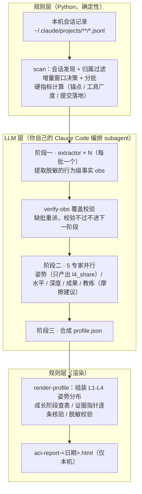

# AI-Coding-Insights

分析你本机的 Claude Code 会话记录，生成四维 AI 协作画像（posture / breadth / depth / outcome）+ 摩擦建议的本地 HTML 报告。形态是 Claude Code plugin，由用户本人手动触发；会话原文与业务语义永不出本机。

## 安装与使用

```
/plugin marketplace add BigKunLun/AI-Coding-Insights
/plugin install ai-coding-insights
```

之后任意 session 中触发：

```
/ai-coding-insights        # 默认增量窗口（自上次检查以来）
/ai-coding-insights 30     # 可选：只看最近 30 天
```

报告输出到当前工作目录 `aci-report-<日期>.html`。

开发 / 调试可免安装，直接以本仓库为插件目录启动：`claude --plugin-dir /path/to/AI-Coding-Insights`，改完代码重启 session 即生效。

## 只分析公司 / 团队项目

零配置即「个人模式」（`mode = "all"`）：分析本机全部会话。要把范围限定在公司/团队项目，写一份 `config.toml`：

```toml
mode = "include"
lookback_days = 30
# 脱敏兜底：列入的词若出现在画像/证据文本中，渲染校验直接失败。
# 必须放在所有 [[include_remotes]] 之前——TOML 表头之后的键值都归属该表。
business_terms = []

[[include_remotes]]
host = "git.example.com"     # 自建 git：整域纳入

[[include_remotes]]
host = "github.com"          # 公共托管域：必须给 org，只纳入该组织
org = "example-org"
```

配置查找顺序（高优先）：CLI 显式 `--config` → 插件根目录 `config.toml`（团队统一下发）→ `~/.claude/ai-coding-insights/config.toml`（个人自管）→ 都没有则回到个人模式。

纳入与否由会话所在目录的 **git remote** 判定：命中 `include_remotes` 任一规则才纳入。判定遵循**宁漏勿误**——不确定归属的一律不进，无 remote 的目录和私人项目从机制上进不来；错配（拼错键名、`include` 模式下规则为空等）直接报错中止，不静默退化成全量分析。

不确定该填什么，可用向导从本机会话数据按来源勾选生成：

```bash
uv run --project <插件目录> python -m ai_coding_insights init
```

## 评分机制与实现原理

### 双层架构

凡是规则能算的不交给 LLM；LLM 只做语义判定，产出结构化数据；像素一律由脚本渲染。两层靠文件契约（manifest / 中间 JSON / profile schema）衔接：



### 四维画像

| 维度 | 看什么 | 数据来源 |
|---|---|---|
| 姿势 posture | 你与 AI 协作的主导程度（L1-L4 分布） | 硬信号 + LLM 判 L3/L4 分界 |
| 水平 breadth | 能力面：工具广度、SubAgent / Workflow / MCP 使用 | 硬指标 |
| 深度 depth | 多轮打磨、纠错的技术具体性、失败→恢复链 | 硬指标 + 行为事实 |
| 成果 outcome | 提交量级与落地节奏（commit / 合入 / 落地率） | 硬指标（git 可独立验证） |

### 姿势分布 L1-L4 怎么算

分母是**决策点**（有效真人输入 + 已答选项数）。L1 / L2 全部硬算，LLM 的唯一输出是一个分界值：

- **L1 跟随**：极短输入占比（如「好」「继续」），规则层直接计数；
- **L2 选择**：回答 AskUserQuestion 选项的占比，规则层直接计数；
- **L3 引导 / L4 主导**：剩余部分按 LLM 给出的 `l4_share` 切分。L3 = 主动给目标/约束/格式、贴报错、追问递进；L4 = 技术具体性纠错、推翻 AI 方案、给 AI 没想到的约束、要求自验或给验收判据、先要方案再放行、编排多 subagent。「未验证就放行」这类伪主导措辞再强也不算 L4。

### 成长阶段判定

由姿势分布 + 两项硬指标查表，从高到低逐档匹配，判据与差距（criteria / gaps）随报告原样展示——让你知道「为什么在这、怎么往上」：

| 阶段 | 条件（须全部满足） |
|---|---|
| 4 引领期 | L4 ≥ 35% 且 L3+L4 ≥ 70% 且 工具广度 ≥ 15 且 提交落地率 ≥ 50% |
| 3 精通期 | L3+L4 ≥ 55% 且 工具广度 ≥ 10 |
| 2 进阶期 | L3+L4 ≥ 35% 且 工具广度 ≥ 6 |
| 1 探索期 | 兜底档 |

首版阈值按「引领期 = 窄口筛头部」设定（业界高主导行为自然占比约 8-16%，无现成个体级分档基准可抄），待积累真实分布后按人群分位重定。

**定位约束**：阶段是给本人看的成长定位，含 LLM 软信号成分，不是考核分数、不得用于奖惩。与奖励挂钩的只能是可独立验证的硬证据（如 git 历史）。机器只给分析与证据，结论与判决在人。

### 隐私设计

- 会话原文与业务语义永不出本机；进入报告的所有自由文本只描述**行为模式与量级**（脱敏规则贯穿每个 subagent，另有 `business_terms` 黑名单在渲染前强制校验）。
- 报告中的每条证据带原始指针（会话文件 + turn uuid），渲染端逐条核验真伪，伪指针公开标注——证据可回看、不可编造。
- 团队模式下归属**宁漏勿误**，名单外项目机制上进不来。

## 开发

```bash
uv run pytest    # 全量测试（零运行时依赖，dev 仅 pytest）

# 规则层手动调试（正常由 skill 编排调用）
uv run python -m ai_coding_insights scan --plugin-root . --emit-batches /tmp/aci-batches
```

架构与约束详见 [CLAUDE.md](CLAUDE.md)。
