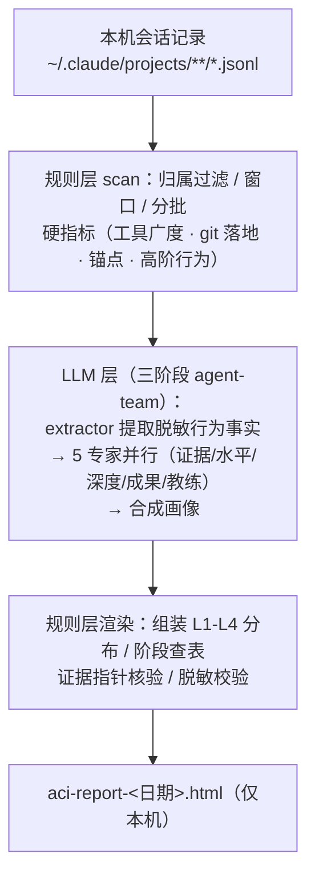

# AI-Coding-Insights

分析你本机的 Claude Code 会话记录，生成 AI 协作画像 + 摩擦建议的本地 HTML 报告：四维画像（posture / breadth / depth / outcome）、成长阶段、高阶行为信号、数据健康雷达。形态是 Claude Code plugin，由用户本人手动触发或在会话结束后台自动评估；**会话原文与业务语义永不出本机**。

## 安装与使用

```
/plugin marketplace add BigKunLun/AI-Coding-Insights
/plugin install ai-coding-insights
```

之后任意 session 中手动触发：

```
/ai-coding-insights        # 默认增量窗口（自上次检查以来）
/ai-coding-insights 30     # 可选：只看最近 30 天
```

报告输出到当前工作目录 `aci-report-<日期>.html`。手动触发走完整管线（含 LLM 语义分析），是拿到完整画像的主路径。

**会话结束自动评估（开箱即用）**：插件注册了 `SessionEnd` hook，每次会话结束后在后台**静默**跑一次增量评估，报告落 `~/.ai-coding-insights/reports/aci-auto-<日期>.html`。它同一天只跑一次、失败不打扰会话退出（诊断日志在 `~/.ai-coding-insights/auto-scan.log`）。后台版是**轻量硬指标快照**——不含 LLM 语义判定（无姿势分档、无摩擦建议、无高光），要完整画像仍需手动 `/ai-coding-insights`。

开发 / 调试可免安装，直接以本仓库为插件目录启动：`claude --plugin-dir /path/to/AI-Coding-Insights`，改完代码重启 session 即生效。

**窗口与使用须知**：

- 距上次检查太近时会提示「攒够再来」（窗口太短不出报告，避免噪声）。
- 本机 transcript 若被 Claude Code 默认 `cleanupPeriodDays`（30 天）清理掉窗口头部，报告会标注「数据截断」。想要完整窗口，把 `~/.claude/settings.json` 的 `cleanupPeriodDays` 调到 ≥60。

## 报告里能看到什么

一份本机 HTML，自上而下：

- **顶部横幅**：成长档位结论 + 四维代表值 + 较上次的同比箭头（基于跨次快照）。
- **指标明细**：按族归类的硬指标——产出落地、协作编排、高阶行为、节奏投入等。
- **高光时刻**：技术具体性最强的最佳 L4 主导实践。
- **姿势分布**：L1-L4 四档占比 + 当前档位的判据，以及距上一档还差什么。
- **四维雷达 + 维度详述**：姿势 / 水平 / 深度 / 成果。
- **摩擦建议**：协作摩擦的行为级观察 + 可执行建议 + 可回看的证据指针。
- **能力盲区**：尚未用上的 Claude Code 能力（自定义 skill / hook / CLAUDE.md 等定制化信号反推）。
- **数据健康（版本漂移雷达）**：本机 CC 版本跨度；某行为信号在老版本普遍出现、新版本几乎掉零时红标「漂移」，提醒该窗口相关维度可能失真；以及 parser 不认识的新记录类型。
- **活动热力图 + 窗口内趋势**。
- **Token / 证据链附录**。
- **页脚**：生成本报告的真实模型名（由规则层从会话记录确定性识别，不采信 LLM 自报）+ 运行耗时 + 编排规模。

四个维度：**姿势**（协作主导程度，L1-L4）、**水平**（工具 / SubAgent / MCP 广度，外加高阶行为：深度推理 thinking、后台委托 background、真并行峰值与轮次）、**深度**（多轮打磨与纠错质量）、**成果**（git 落地，可独立验证）。

## 只分析公司 / 团队项目

不配置时是「个人模式」：分析本机全部会话。要只分析公司/团队项目，按下面三步：

**第 1 步：查你的公司项目的 git remote。** 进任意一个公司项目目录，运行 `git remote -v`，对照 URL 找出该填的值：

| 你看到的 remote URL | 该填的规则 |
|---|---|
| `git@git.mycorp.com:backend/api.git` | `host = "git.mycorp.com"`（公司自建 git，整个域都算公司项目） |
| `https://github.com/mycorp/api.git` | `host = "github.com"` + `org = "mycorp"`（公共托管，必须精确到组织） |

**第 2 步：创建 `~/.claude/ai-coding-insights/config.toml`**，把上面的值填进去：

```toml
mode = "include"

[[include_remotes]]
host = "git.mycorp.com"

[[include_remotes]]
host = "github.com"
org = "mycorp"
```

公司项目只在一处托管的，留一条 `[[include_remotes]]` 即可。

**第 3 步：重新运行 `/ai-coding-insights`**，小结和报告会显示「团队模式」，此时只有 remote 命中上述规则的项目会被纳入。

不想手填？在本仓库目录运行向导，它会列出你本机会话的全部来源供勾选，自动生成配置：

```bash
uv run python -m ai_coding_insights init
```

两个补充规则：

- **宁漏勿误**：归属判定不确定的项目一律不纳入；无 git remote 的目录、私人项目从机制上进不来。配置写错（拼错键名、规则为空、mode 非法）会直接报错，不会静默退回全量分析。
- 给团队统一下发时，可把同一份 `config.toml` 放在插件根目录随插件分发，优先级高于个人配置。

可选项：`config.toml` 还可设 `lookback_days`（默认窗口天数）和 `business_terms`（脱敏兜底名单——画像里若出现这些词会直接校验失败，作为隐私网最后一道闸）。

## 评分机制与实现原理

凡是规则能算的（会话发现、硬指标、渲染）由 Python 确定性计算；LLM 只做语义判定，且全程只见脱敏后的行为事实：



四个维度：**姿势**（协作主导程度，L1-L4 分布）、**水平**（工具/SubAgent/MCP 广度 + 高阶行为）、**深度**（多轮打磨与纠错质量）、**成果**（git 落地率，git 可独立验证）。

**姿势四档**（L1 跟随 / L2 选择 / L3 引导 / L4 主导）由阶段一 extractor 看脱敏原文**逐 turn 语义分档**（`verify-obs` 闸住「每会话四档之和 == 输入条数」），规则层只做算术聚合；其中 AskUserQuestion 答题作为协议级硬信号直接并入 L2。

**成长阶段**从低到高分四档（探索 / 进阶 / 精通 / 引领），按 **L4 主导占比、L3+L4 合计、工具广度、git 落地率**四个维度查表判定：

| 阶段 | 判定方向（具体门槛以 `stage.py` 为准，每档判据与你的实际差距都内联在报告里） |
|---|---|
| 4 引领期 | 四项全达标：L4 主导、L3+L4 合计、工具广度、git 落地率均到高位门槛 |
| 3 精通期 | L3+L4 合计与工具广度达到中段门槛 |
| 2 进阶期 | 开始主动引导：L3+L4 与工具广度过下沿门槛 |
| 1 探索期 | 兜底档 |

> 阈值随口径重校（2026-06-12 起为 v2 逐 turn 语义分档口径，较 v1 各档约折半）。**README 刻意不复述具体数值，以代码为准**——快照带口径标记，跨口径不可同比。

**成果**以 git 主锚口径为准：落地数与落地率的分子分母都来自 git 历史（HEAD 祖先 + 本机 `user.email` + 提交 author 时间落入会话时间窗），**可独立验证、不依赖 LLM**；且只读提交时间戳，提交信息与文件名永不读取。报告同时给 transcript 口径（会话内可观测的提交 / 丢弃）作参考——当会话记录不含提交回执（CC 版本差异）时，git 口径仍能测到落地，避免误判「落地为零」。

**定位约束**：阶段是给本人看的成长定位，不是考核分数、不得用于奖惩；机器只给分析与证据，结论在人。

## 隐私保证

隐私是定位级铁律，落在机制上而非自觉：

- **不出本机**：会话原文与业务语义永不离开本机；进入报告的姿势 / 证据 / 建议自由文本只描述**行为模式与量级**，绝不含客户 / 功能 / 产品 / 架构等业务内容。
- **业务标识不进 LLM**：含项目名的数据（cwd 绝对路径、按项目细分）既不进 LLM 上下文、不进 `/tmp` 批次产物、也不进跨次快照；报告里项目只以「项目N」序号出现。
- **密钥网**：进入 LLM 层（经 Anthropic API）的批次文本，在出规则层前就地脱敏——覆盖 PEM 私钥、JWT、连接串内嵌口令、各厂商 token（OpenAI / Anthropic / GitHub / Slack / AWS / Google）、Bearer 头、带标签的 `api_key`/`password`/`secret` 等，取向宁可过度脱敏。
- **证据可信**：每条证据指针逐条 IO 回看核验，LLM 编造的路径或拿会话 id 冒充 turn uuid 会在报告中公开标注「指针未命中」；页脚模型名由规则层从 transcript 确定性识别，不采信 LLM 自报。
- **归属宁漏勿误**：判定不确定的项目一律不纳入，私人会话从机制上进不来。

## 开发

```bash
uv run pytest    # 全量测试（Python ≥3.11，零运行时依赖，dev 仅 pytest）

# 规则层手动调试（正常由 skill 编排调用）
uv run python -m ai_coding_insights scan --plugin-root . --emit-batches /tmp/aci-batches
```

规则层共 5 个子命令：`scan`（扫描 / 分批 / 硬指标）、`init`（交互配置向导）、`verify-obs`（校验 LLM 观测对批次的覆盖与完整性）、`render-profile`（渲染画像 HTML）、`auto-scan`（SessionEnd hook 后台自动评估）——除调试外均由 skill 编排调用。

架构与约束详见 [CLAUDE.md](CLAUDE.md)。
