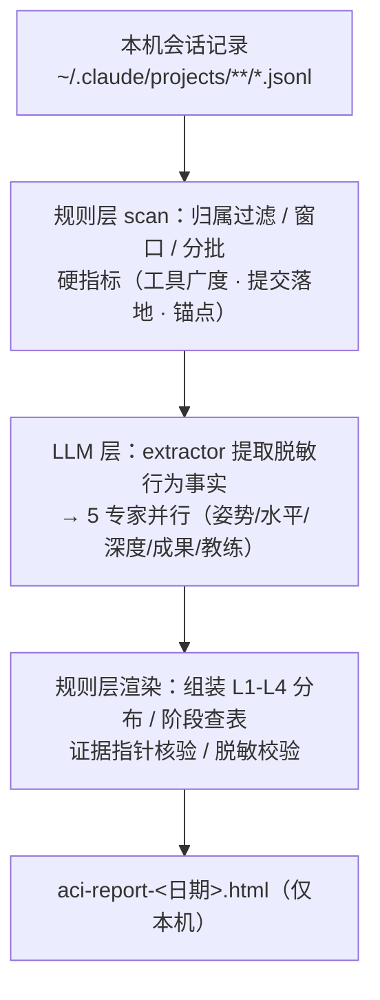

# AI-Coding-Insights

分析你本机的 Claude Code 会话记录，生成四维 AI 协作画像（posture / breadth / depth / outcome）+ 摩擦建议的本地 HTML 报告。形态是 Claude Code plugin，由用户本人手动触发；会话原文与业务语义永不出本机。

## 安装与使用

```
/plugin marketplace add BigKunLun/AI-Coding-Insights
/plugin install ai-coding-insights
```

之后任意 session 中触发：

```
/ai-coding-insights        # 默认增量窗口（自上次检查以来）
/ai-coding-insights 30     # 可选：只看最近 30 天
```

报告输出到当前工作目录 `aci-report-<日期>.html`。

开发 / 调试可免安装，直接以本仓库为插件目录启动：`claude --plugin-dir /path/to/AI-Coding-Insights`，改完代码重启 session 即生效。

## 只分析公司 / 团队项目

不配置时是「个人模式」：分析本机全部会话。要只分析公司/团队项目，按下面三步：

**第 1 步：查你的公司项目的 git remote。** 进任意一个公司项目目录，运行 `git remote -v`，对照 URL 找出该填的值：

| 你看到的 remote URL | 该填的规则 |
|---|---|
| `git@git.mycorp.com:backend/api.git` | `host = "git.mycorp.com"`（公司自建 git，整个域都算公司项目） |
| `https://github.com/mycorp/api.git` | `host = "github.com"` + `org = "mycorp"`（公共托管，必须精确到组织） |

**第 2 步：创建 `~/.claude/ai-coding-insights/config.toml`**，把上面的值填进去：

```toml
mode = "include"

[[include_remotes]]
host = "git.mycorp.com"

[[include_remotes]]
host = "github.com"
org = "mycorp"
```

公司项目只在一处托管的，留一条 `[[include_remotes]]` 即可。

**第 3 步：重新运行 `/ai-coding-insights`**，小结和报告会显示「团队模式」，此时只有 remote 命中上述规则的项目会被纳入。

不想手填？在本仓库目录运行向导，它会列出你本机会话的全部来源供勾选，自动生成配置：

```bash
uv run python -m ai_coding_insights init
```

两个补充规则：

- **宁漏勿误**：归属判定不确定的项目一律不纳入；无 git remote 的目录、私人项目从机制上进不来。配置写错（拼错键名、规则为空）会直接报错，不会静默退回全量分析。
- 给团队统一下发时，可把同一份 `config.toml` 放在插件根目录随插件分发，优先级高于个人配置。

## 评分机制与实现原理

凡是规则能算的（会话发现、硬指标、渲染）由 Python 确定性计算；LLM 只做语义判定，且全程只见脱敏后的行为事实：



四个维度：**姿势**（协作主导程度，L1-L4 分布）、**水平**（工具/SubAgent/MCP 广度）、**深度**（多轮打磨与纠错质量）、**成果**（commit 与落地率，git 可独立验证）。

姿势分布里 L1（极短输入「好」「继续」）和 L2（点选项）由规则层硬算，LLM 唯一的输出是剩余部分中 L4 主导（纠错、推翻方案、给验收判据）相对 L3 引导（给目标、贴报错）的份额。

成长阶段按阈值查表，判据与差距随报告展示：

| 阶段 | 条件（须全部满足） |
|---|---|
| 4 引领期 | L4 ≥ 35% 且 L3+L4 ≥ 70% 且 工具广度 ≥ 15 且 落地率 ≥ 50% |
| 3 精通期 | L3+L4 ≥ 55% 且 工具广度 ≥ 10 |
| 2 进阶期 | L3+L4 ≥ 35% 且 工具广度 ≥ 6 |
| 1 探索期 | 兜底档 |

**定位约束**：阶段是给本人看的成长定位，不是考核分数、不得用于奖惩；机器只给分析与证据，结论在人。隐私上，进入报告的自由文本只含行为模式与量级，每条证据的指针（会话文件 + turn uuid）渲染时逐条核验，伪指针公开标注。

## 开发

```bash
uv run pytest    # 全量测试（零运行时依赖，dev 仅 pytest）

# 规则层手动调试（正常由 skill 编排调用）
uv run python -m ai_coding_insights scan --plugin-root . --emit-batches /tmp/aci-batches
```

架构与约束详见 [CLAUDE.md](CLAUDE.md)。
