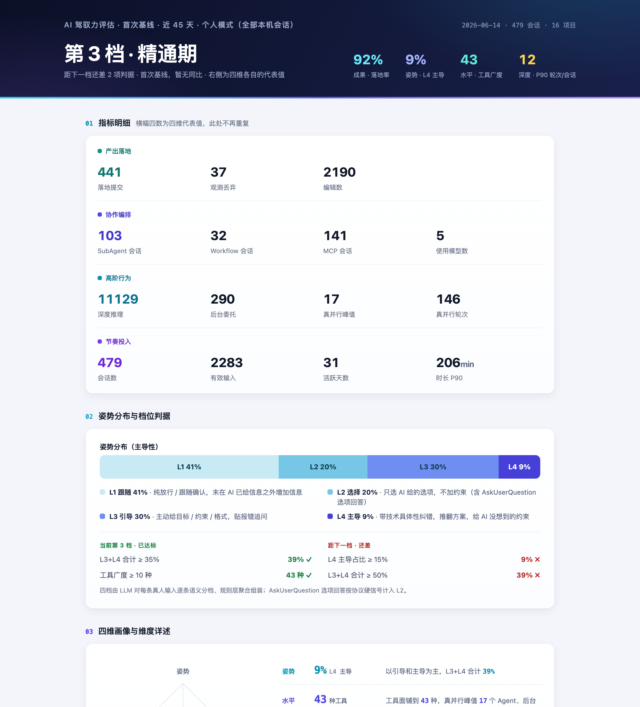
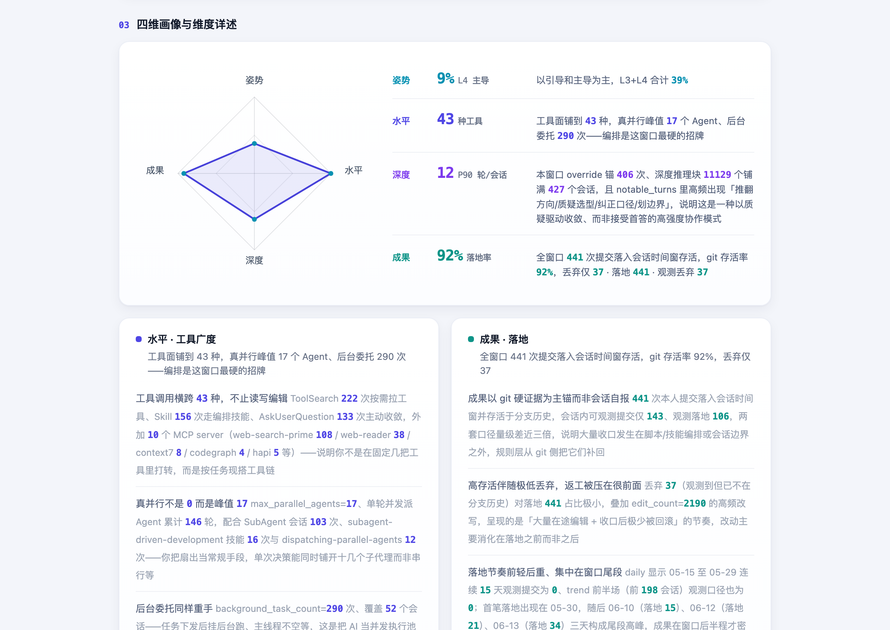
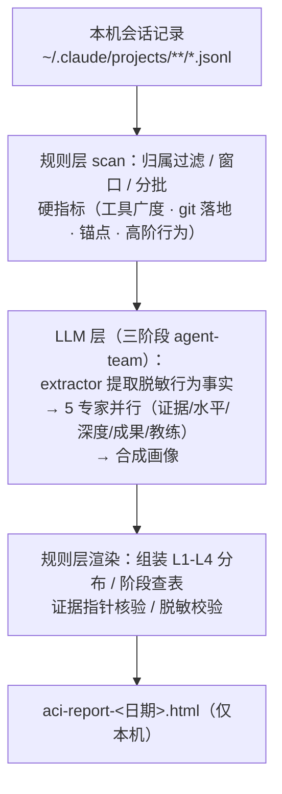

<div align="center">

# 你和 Claude Code 到底是怎么合作的？

**装完一条命令，看见你自己的 AI 协作画像——**
你是在「使唤 AI」，还是在「与 AI 共创」？
数据不出本机，结论留给你自己。




</div>

一个 Claude Code 插件，只读你本机的会话记录，给你一份 AI 协作画像 + 摩擦建议的本地 HTML 报告。**会话原文与业务语义永不出本机**——机器只给分析与证据，结论与判断在你自己。

## 30 秒上手

```
/plugin marketplace add BigKunLun/AI-Coding-Insights
/plugin install ai-coding-insights
```

装好后，在任意会话里：

```
/ai-coding-insights        # 默认增量窗口（自上次检查以来）
/ai-coding-insights 30     # 可选：只看最近 30 天
```

报告落在当前目录 `aci-report-<日期>.html`，浏览器打开即看。就这么多——剩下的事它替你算。

## 你会看到什么

报告从四个维度给你画像，回答那句开头的问题——**你到底是使唤 AI，还是和它共创**：

- **姿势**：你是发号施令，还是并肩共创？逐 turn 语义分档 L1 跟随 → L4 主导，告诉你当前档位、以及距上一档还差什么。
- **水平**：你用上了 Claude Code 多少件武器？工具 / SubAgent / MCP 广度，外加深度推理、后台委托、真并行峰值这些高阶动作。
- **深度**：一个问题你打磨了几轮、纠错质量如何——是一锤子买卖，还是反复雕琢。
- **成果**：聊完之后，真的落进 git 了吗？落地率以 git 历史为锚，**可独立验证，不靠 LLM 自说自话**。

<div align="center">

</div>

挑几个最有意思的看点：

- **成长横幅**：成长档位结论 + 较上次的同比箭头（探索 → 进阶 → 精通 → 引领）。
- **高光时刻**：你这段时间技术具体性最强的一次主导实践。
- **摩擦建议**：协作里卡顿的行为级观察 + 可执行建议 + 可回看的证据指针。
- **能力盲区**：你还没用上的 Claude Code 能力（自定义 skill / hook / CLAUDE.md 等定制信号反推）。
- **版本漂移雷达**：某行为信号在老版本普遍、新版本掉零时红标提醒，免得拿失真数据下结论。

**会话结束还会自动跑一次**（开箱即用）：插件注册了 `SessionEnd` hook，每次会话结束后台静默出一份轻量硬指标快照，落在 `~/.ai-coding-insights/reports/`。它同一天只跑一次、失败不打扰你退出会话。完整画像（含 LLM 语义分析、姿势分档、摩擦建议）仍以手动 `/ai-coding-insights` 为主路径。

## 它凭什么可信

这类工具最容易让人警惕两件事：**我的代码会不会被偷看？这分数会不会被拿去考核我？** 这个项目从机制上回答这两个问题，不靠嘴上保证。

**隐私是铁律，落在机制上：**

- **不出本机**：会话原文与业务语义永不离开本机；进入报告的所有自由文本只描述**行为模式与量级**，绝不含客户 / 功能 / 产品 / 架构等业务内容。
- **业务标识不进 LLM**：含项目名的数据既不进 LLM 上下文、不进中间产物、也不进跨次快照；报告里项目只以「项目N」序号出现。
- **密钥网兜底**：进入 LLM 层的文本在出规则层前就地脱敏，覆盖私钥 / JWT / 各厂商 token / 连接串口令等，取向宁可过度脱敏。
- **证据可信**：每条证据指针逐条 IO 回看核验，LLM 编造的路径会在报告中公开标注「指针未命中」；页脚模型名由规则层从会话记录确定性识别，不采信 LLM 自报。

**人在环 & 硬成果可验证：**

机器不下最终判决、不自动定奖惩。成长档位是给你自己看的成长定位，不是考核分数。与「成果」相关的落地率以 git 主锚口径计算——按 git author 历史 + 本机邮箱归属到会话时间窗，**独立于 transcript 与 LLM，可任何人复算**；且只读提交时间戳，提交信息与文件名永不读取。

**它怎么做到的——双层分工，规则的归规则，语义的归 LLM：**


```mermaid
flowchart TB
    A["本机会话记录<br/>~/.claude/projects/**/*.jsonl"] --> B["规则层 scan：归属过滤 / 窗口 / 分批<br/>硬指标（工具广度 · git 落地 · 锚点 · 高阶行为）"]
    B --> C["LLM 层（三阶段 agent-team）：<br/>extractor 提取脱敏行为事实<br/>→ 5 专家并行（证据/水平/深度/成果/教练）<br/>→ 合成画像"]
    C --> D["规则层渲染：组装 L1-L4 分布 / 阶段查表<br/>证据指针核验 / 脱敏校验"]
    D --> E["aci-report-&lt;日期&gt;.html（仅本机）"]
```

凡是规则能算的（会话发现、硬指标、渲染）由 Python 确定性计算；LLM 只做语义判定，且全程只见脱敏后的行为事实。

## 只看团队项目

不配置时是**个人模式**，分析本机全部会话。想只看公司 / 团队项目，三步搞定：

**第 1 步：查公司项目的 git remote。** 进任意公司项目目录跑 `git remote -v`，对照填值：

| 你看到的 remote URL | 该填的规则 |
|---|---|
| `git@git.mycorp.com:backend/api.git` | `host = "git.mycorp.com"`（自建 git，整域都算公司项目） |
| `https://github.com/mycorp/api.git` | `host = "github.com"` + `org = "mycorp"`（公共托管，须精确到组织） |

**第 2 步：创建 `~/.claude/ai-coding-insights/config.toml`：**

```toml
mode = "include"

[[include_remotes]]
host = "git.mycorp.com"

[[include_remotes]]
host = "github.com"
org = "mycorp"
```

**第 3 步：重新运行 `/ai-coding-insights`**，报告会显示「团队模式」，此时只有命中规则的项目被纳入。

> **宁漏勿误**：归属判定不确定的项目一律不纳入；无 git remote 的目录、私人项目从机制上进不来。配置写错会直接报错，不会静默退回全量分析。

不想手填？在本仓库目录跑 `uv run python -m ai_coding_insights init`，向导会列出本机会话来源供你勾选，自动生成配置。

## 进阶 & 须知

<details>
<summary><b>窗口与数据须知</b></summary>

- 距上次检查太近会提示「攒够再来」（窗口太短不出报告，避免噪声）。
- 本机 transcript 若被 Claude Code 默认 `cleanupPeriodDays`（30 天）清掉窗口头部，报告会标注「数据截断」。想要完整窗口，把 `~/.claude/settings.json` 的 `cleanupPeriodDays` 调到 ≥60。
- `config.toml` 还可设 `lookback_days`（默认窗口天数）和 `business_terms`（脱敏兜底名单，画像里出现这些词会直接校验失败）。
- 给团队统一下发时，可把同一份 `config.toml` 放在插件根目录随插件分发，优先级高于个人配置。

</details>

<details>
<summary><b>免安装调试 & 开发</b></summary>

以本仓库为插件目录直接启动，改完代码重启 session 即生效：

```bash
claude --plugin-dir /path/to/AI-Coding-Insights
```

```bash
uv run pytest    # 全量测试（Python ≥3.11，零运行时依赖，dev 仅 pytest）

# 规则层手动调试（正常由 skill 编排调用）
uv run python -m ai_coding_insights scan --plugin-root . --emit-batches ~/.ai-coding-insights/run
```

规则层共 6 个子命令：`scan`（扫描 / 分批 / 硬指标）、`init`（配置向导）、`verify-obs`（校验 LLM 观测覆盖）、`render-profile`（渲染画像 HTML）、`auto-scan`（SessionEnd 后台评估）、`reset`（清本机产物以便干净重测）——除调试外均由 skill 编排调用。

架构与不变约束详见 [CLAUDE.md](CLAUDE.md)。

</details>

## License

[MIT](LICENSE) © 2026 BigKunLun
