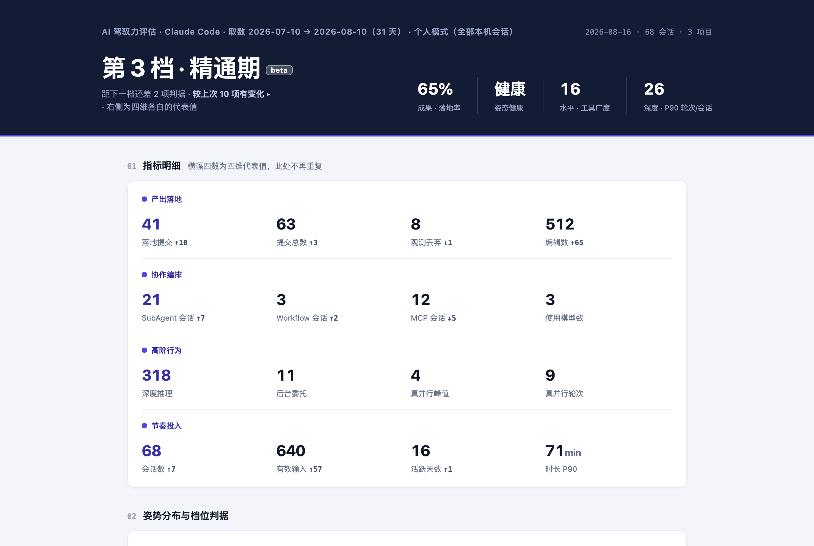
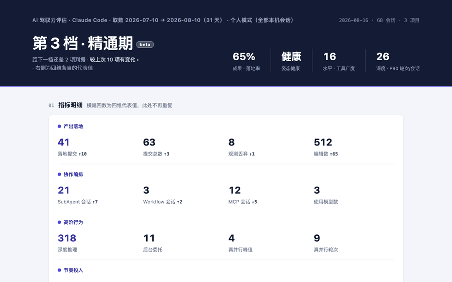
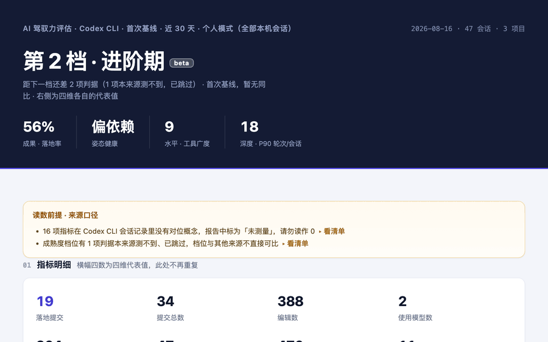
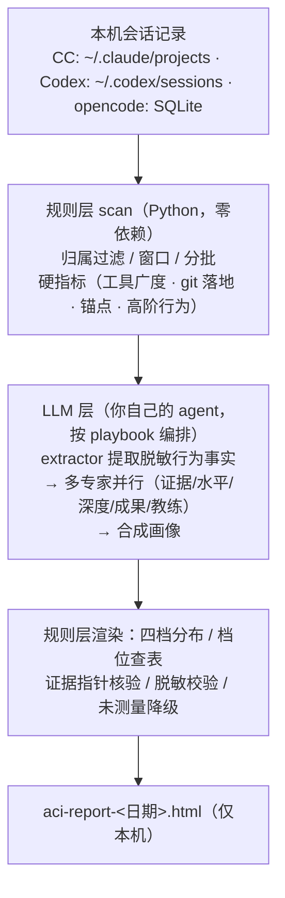

<div align="center">

# 你和 AI 到底是怎么合作的？

**一条命令装上，在你自己的 agent 里说一句话，看见你的 AI 协作画像——**
你是在「使唤 AI」，还是在「与 AI 共创」？
数据不出本机，结论留给你自己。

`Claude Code` ｜ `Codex CLI` ｜ `opencode` —— 在哪个里触发，就分析哪家的会话

```bash
uvx ai-coding-insights install
```



<sub>↑ 真实渲染的 <a href="docs/demo/aci-report-demo.html">demo 报告</a>截图，数据全部虚构</sub>


</div>

只读你本机的 AI 编码会话记录，给你一份**协作画像 + 摩擦建议**的本地 HTML 报告。
**会话原文与业务语义永不出本机**——机器只给分析与证据，结论与判断在你自己。

**不自建 Harness**：你 PATH 上已经在用的那个 agent CLI 就是引擎。本项目不 ship agent、
不要 API key——语义分析在你自己的会话里跑，订阅额度天然覆盖。

## 30 秒上手

**第 1 步 · 装**（`uvx` 来自 [uv](https://docs.astral.sh/uv/)；不确定会写到哪就先 `--print` 预演，只看落点不写盘）：

```bash
uvx ai-coding-insights install           # 装到「你当前所在的 harness」该放的位置
uvx ai-coding-insights install --print   # 预演：只打印落点与内容大小，不写盘
uvx ai-coding-insights install --source codex --force   # 指定一家 / 覆盖已有
```

**第 2 步 · 在你的 agent 里触发一句话**（三家各自的调用约定不同，装完就是这个名字）：

| Harness | 触发 | playbook 落位 |
|---|---|---|
| **Claude Code** | `/ai-coding-insights` | `~/.claude/skills/ai-coding-insights/SKILL.md` |
| **Codex CLI** | `$ai-coding-insights` | `~/.agents/skills/ai-coding-insights/SKILL.md` |
| **opencode** | `/ai-coding-insights` | `~/.config/opencode/commands/ai-coding-insights.md` |

**第 3 步 · 看报告**：落在当前目录 `aci-report-<日期>.html`，浏览器打开即看。

> **数据源跟触发环境走**：在 Codex 里触发就分析 Codex 的会话，哪怕你机器上也装着
> Claude Code。判定只看当前进程的环境变量，不去 PATH 上探测「你装了什么」——装了不等于在用。

<div align="center">

</div>

<sub>15 秒滚一遍 demo 报告（假数据）。每一帧都是 headless Chrome 对
[`docs/demo/aci-report-demo.html`](docs/demo/aci-report-demo.html) 的真实截图，没有任何合成或美化；
录法见 [`docs/demo/README.md`](docs/demo/README.md)。终端里「装 → 触发」那一段还没录，
分镜在 [`docs/demo/录制脚本.md`](docs/demo/录制脚本.md)。</sub>

## 先看一眼样例报告

两份**全部为假数据**的 demo（GitHub 不渲染 HTML，点开后下载或本地 clone 后双击打开）：

- [`docs/demo/aci-report-demo.html`](docs/demo/aci-report-demo.html) —— Claude Code 场景：完整四维画像、档位判据、与上次的同比箭头。
- [`docs/demo/aci-report-demo-codex.html`](docs/demo/aci-report-demo-codex.html) —— Codex 场景：**「未测量 ≠ 0」**的渲染与置顶的来源口径 caveat。

<div align="center">

<br><sub>Codex 能力子集下的报告：<b>主网格只放测得到的指标</b>，
测不到的收进折叠区块——点开就能看到是哪几项。<b>测不到 ≠ 0</b>，
把 Codex 里根本不存在的 Workflow 渲染成「0 次」，用户读到的是「你没用过」这个错误结论。</sub>
</div>

说明与重新生成方式见 [`docs/demo/README.md`](docs/demo/README.md)。demo 里的证据指针
全部标着 ⚠「指针未命中」——那是**预期行为**：报告渲染前会逐条回看指针指向的真实位置，
假数据当然核不到。你自己跑出来的报告里，这些指针可点回看。

## 你会看到什么

报告从四个维度给你画像，回答开头那句话——**你到底是使唤 AI，还是和它共创**：

- **姿势**：你是发号施令，还是并肩共创？逐 turn 语义分档 L1 跟随 → L4 主导，给出姿态健康态与距上一档还差什么。
- **水平**：你用上了手里这把工具的多少件武器？工具广度、子代理、深度推理、后台委托、真并行峰值。
- **深度**：一个问题你打磨了几轮、纠错质量如何——是一锤子买卖，还是反复雕琢。
- **成果**：聊完之后真的落进 git 了吗？落地率以 git 历史为锚，**可独立复算，不靠 LLM 自说自话**。
- **摩擦建议**：协作里卡顿的行为级观察 + 可执行建议 + 可回看的证据指针。

外加几个看点：**成长档位**（探索 → 进阶 → 精通 → 引领，挂 beta 角标）、**高光时刻**、
**能力盲区**（你还没用上的能力 + 什么场景该用）、**版本漂移雷达**（某信号在新版本掉零时红标，
免得拿失真数据下结论）。

**会话结束自动跑一次**（仅 Claude Code，且仅走下面「插件入口」那种装法时）：插件清单里注册了
`SessionEnd` hook，会话结束后台静默出一份轻量硬指标快照，落在 `~/.ai-coding-insights/reports/`；
同一天只跑一次、失败不打扰你退出会话。Codex / opencode 没有对位的生命周期 hook，
这项能力在那两家显式不可用（是明说不可用，不是静默不跑）。

## 它凭什么可信

这类工具最容易让人警惕两件事：**我的代码会不会被偷看？这分数会不会被拿去考核我？**
下面三条不是口头保证，是落在机制上的。

**一 · 隐私：原文与业务语义永不出本机**

- **不出本机**：进入报告的所有自由文本只描述**行为模式与量级**，绝不含客户 / 功能 / 产品 / 架构等业务内容。
- **业务标识不进 LLM**：含项目名的数据既不进 LLM 上下文、不进中间产物、也不进跨次快照；报告里项目只以序号出现。
- **密钥网兜底**：进入 LLM 层的文本在出规则层前就地脱敏，覆盖私钥 / JWT / 各厂商 token / 连接串口令，取向宁可过度脱敏。
- **文件路径只在本机内求交**：git 落地判定要用到「提交改动文件 ∩ 会话编辑文件」，这个交集只在你机器上算，**路径与 diff 永不出本机，只出计数**。
- **证据可信**：每条证据指针逐条回看核验，LLM 编造的路径会在报告里公开标注「指针未命中」。

**二 · 人在环：机器不下判决**

机器只给软信号初筛 + 可验证证据入口，**不自动定奖惩、不出最终结论**。成长档位是给你自己看的
定位，不是考核分数——而且它挂着 beta：阈值是初设值，只经本机单人分布粗校，**无人群分位背书**。

**三 · 硬成果可验证**

与「成果」相关的落地率走 git 主锚口径：按 git author 历史 + 本机 `user.email`，
以「提交改动文件 ∩ 会话编辑文件」归属落地，落地率 = 落地 ÷ 窗口内同仓本人提交总数。
**独立于会话记录与 LLM，任何人都能自己复算。**

## 三家能力矩阵：未测量 ≠ 0

不同 harness 的会话记录里，能测到的概念**不一样**。Codex 压根没有 Workflow 这个概念，
若照常渲染成「0 次」，你读到的是「你没用过 Workflow」这个**错误结论**。
所以测不到的一律标「未测量」，档位判定跳过对应判据并在报告里说明「与其他来源不直接可比」。
反向不成立：**观测到非零就说明测得到**，能力集是保守声明，可事后放宽。

<!-- 下表由 `uv run python docs/demo/生成能力矩阵.py` 从 sources.py 生成，请勿手改 -->

| 能力 / 概念 | 缺失时被标「未测量」的报告指标 | Claude Code | Codex CLI | opencode |
|---|---|:---:|:---:|:---:|
| MCP 外部工具 | MCP 会话、MCP 服务器分布 | ✅ 测得到 | ⚪️ 未测量 | ⚪️ 未测量 |
| Skill / 斜杠命令调用 | 技能使用会话数、技能调用次数 | ✅ 测得到 | ⚪️ 未测量 | ✅ 测得到 |
| Token 计量 | Token 明细、Token 总量 | ✅ 测得到 | ✅ 测得到 | ✅ 测得到 |
| Workflow 确定性编排 | Workflow 会话 | ✅ 测得到 | ⚪️ 未测量 | ⚪️ 未测量 |
| 会话内 git 提交回执 | 会话内提交、会话内落地、观测丢弃 | ✅ 测得到 | ⚪️ 未测量 | ⚪️ 未测量 |
| 会话编辑文件集（git 落地锚的交集来源） | 落地提交、提交总数、落地率 | ✅ 测得到 | ✅ 测得到 | ✅ 测得到 |
| 后台委托 | 后台委托、后台委托会话 | ✅ 测得到 | ⚪️ 未测量 | ⚪️ 未测量 |
| 子代理派发（含真并行峰值） | SubAgent 会话、真并行峰值、真并行轮次 | ✅ 测得到 | ⚪️ 未测量 | ✅ 测得到 |
| 工具调用（工具广度 / 各工具覆盖） | 工具广度、各工具使用会话数 | ✅ 测得到 | ✅ 测得到 | ✅ 测得到 |
| 深度推理块 | 深度推理块、深度推理会话 | ✅ 测得到 | ✅ 测得到 | ✅ 测得到 |
| 用户自建扩展（文件系统扫描） | 自建技能数 | ✅ 测得到 | ✅ 测得到 | ✅ 测得到 |
| 结构化选项应答 | 选项应答数 | ✅ 测得到 | ⚪️ 未测量 | ⚪️ 未测量 |
| 编辑动作计数 | 编辑数 | ✅ 测得到 | ✅ 测得到 | ✅ 测得到 |
| 计划模式（先出方案再放行） | 计划模式会话、计划模式次数 | ✅ 测得到 | ⚪️ 未测量 | ✅ 测得到 |
| 项目约定文件（CLAUDE.md 一类） | 项目约定文件改动 | ✅ 测得到 | ✅ 测得到 | ✅ 测得到 |
| 任务清单工具（多步任务维护进度） | （不进未测量字段集，各自在别处降级） | ✅ 测得到 | ✅ 测得到 | ✅ 测得到 |
| 生命周期 hook（会话结束自动快照的前提） | （不进未测量字段集，各自在别处降级） | ✅ 测得到 | ⚪️ 未测量 | ⚪️ 未测量 |
| 联网检索 / 抓取 | （不进未测量字段集，各自在别处降级） | ✅ 测得到 | ⚪️ 未测量 | ✅ 测得到 |
| 记录带 CLI 版本号（版本漂移雷达） | （不进未测量字段集，各自在别处降级） | ✅ 测得到 | ✅ 测得到 | ✅ 测得到 |

> 这张表**不是手抄的**：它由 `uv run python docs/demo/生成能力矩阵.py` 从 `sources.py` 的
> 能力集声明与 `CAPABILITY_METRICS` 映射直接生成。代码放宽了能力而表没跟着变，
> 等于给「未测量 ≠ 0」造了第二个真相源。

## 不想花 token？只跑规则层

硬指标全部由规则层确定性计算，**不经过任何 LLM**。只要不进语义分析那一步，就一分 token 不花：

```bash
# 硬指标全量落盘（_aggregate.json），并把批次清单打到 stdout
uv run python -m ai_coding_insights scan --plugin-root . --emit-batches ~/.ai-coding-insights/run

# 指定来源（不传则跟触发环境走）
uv run python -m ai_coding_insights scan --source codex --emit-batches ~/.ai-coding-insights/run
```

拿到的是工具广度、git 落地、活跃节奏、锚点计数等**可复算的硬数字**。
姿势分档、摩擦建议这些语义判定才需要你的 agent 出场——那一步走你自己的订阅额度。

## 只看团队项目

不配置时是**个人模式**，分析本机全部会话。想只看公司 / 团队项目，三步搞定：

**第 1 步：查公司项目的 git remote。** 进任意公司项目目录跑 `git remote -v`，对照填值：

| 你看到的 remote URL | 该填的规则 |
|---|---|
| `git@git.mycorp.com:backend/api.git` | `host = "git.mycorp.com"`（自建 git，整域都算公司项目） |
| `https://github.com/mycorp/api.git` | `host = "github.com"` + `org = "mycorp"`（公共托管，须精确到组织） |

**第 2 步：创建 `~/.claude/ai-coding-insights/config.toml`：**

```toml
mode = "include"

[[include_remotes]]
host = "git.mycorp.com"

[[include_remotes]]
host = "github.com"
org = "mycorp"
```

**第 3 步：重新触发一次**，报告会显示「团队模式」，此时只有命中规则的项目被纳入。

> **宁漏勿误**：归属判定不确定的项目一律不纳入；无 git remote 的目录、私人项目从机制上进不来。
> 配置写错会直接报错，不会静默退回全量分析。

不想手填？跑 `uv run python -m ai_coding_insights init`，向导会列出本机会话来源供你勾选，自动生成配置。

## 它怎么做到的

双层分工，规则的归规则，语义的归 LLM：


```mermaid
flowchart TB
    A["本机会话记录<br/>CC: ~/.claude/projects · Codex: ~/.codex/sessions · opencode: SQLite"] --> B["规则层 scan（Python，零依赖）<br/>归属过滤 / 窗口 / 分批<br/>硬指标（工具广度 · git 落地 · 锚点 · 高阶行为）"]
    B --> C["LLM 层（你自己的 agent，按 playbook 编排）<br/>extractor 提取脱敏行为事实<br/>→ 多专家并行（证据/水平/深度/成果/教练）<br/>→ 合成画像"]
    C --> D["规则层渲染：四档分布 / 档位查表<br/>证据指针核验 / 脱敏校验 / 未测量降级"]
    D --> E["aci-report-&lt;日期&gt;.html（仅本机）"]
```

- **规则层**（本仓库 Python，纯 stdlib 零依赖）：凡是能用规则算的，都不交给 LLM。
- **LLM 层**（单一真相源 playbook，安装器按各家规矩落位）：只做语义判定，产出结构化数据；
  像素（HTML）一律由脚本渲染。
- **无并行子代理的 harness 走降级编排**，且**降级状态写进报告 caveat**——
  静默劣化（不报错、只安静产出一份看起来正常的低质报告）是本项目定义的最危险故障。

## 现状与路线

当前 `1.0.0-alpha.1`（v1 预发布，三家齐了才发正式版）。三家的验证深度**不一样**：
Claude Code 最充分，Codex 已有实测样本，opencode 只验证过单一版本、schema 漂移风险最高。
档位阈值仍是初设值（beta 角标）。

完整路线、非目标（v1 明确不做什么）与参与方式见 **[docs/roadmap.md](docs/roadmap.md)**。

## 进阶 & 须知

<details>
<summary><b>窗口与数据须知</b></summary>

- 距上次检查太近会提示「攒够再来」（窗口太短不出报告，避免噪声）。想干净重测可跑
  `uv run python -m ai_coding_insights reset --dry-run` 先看会删什么，去掉 `--dry-run` 才真删；
  它只删本机可再生产物（快照 / 报告 / 中间产物），永不碰配置与会话原文。
- 本机 transcript 若被 harness 自身的清理策略（如 Claude Code 默认 `cleanupPeriodDays=30`）
  清掉窗口头部，报告会标注「数据截断」。想要完整窗口，把对应设置调大。
- `config.toml` 还可设 `lookback_days`（默认窗口天数）和 `business_terms`
  （脱敏兜底名单，画像里出现这些词会直接校验失败）。
- 团队统一下发时，可把同一份 `config.toml` 放在插件根目录随插件分发，优先级高于个人配置。

</details>

<details>
<summary><b>Claude Code 插件入口（并行方式）</b></summary>

除 `uvx … install` 外，Claude Code 用户也可以走 marketplace 装成插件：

```
/plugin marketplace add BigKunLun/AI-Coding-Insights
/plugin install ai-coding-insights
```

以本仓库为插件目录直接启动（改完代码重启 session 即生效）：

```bash
claude --plugin-dir /path/to/AI-Coding-Insights
```

</details>

<details>
<summary><b>开发</b></summary>

```bash
uv run pytest    # 全量测试（Python ≥3.11，零运行时依赖，dev 仅 pytest）
```

规则层共 8 个子命令：`scan`（扫描 / 分批 / 硬指标）、`init`（配置向导）、
`verify-obs`（校验 LLM 观测覆盖）、`render-profile`（渲染画像 HTML）、
`auto-scan`（SessionEnd 后台评估）、`reset`（清本机产物）、
`install`（把 playbook 装到当前 harness）、`calibrate`（阈值分位定位，手动调试用）
——除调试外均由 playbook 编排调用。

架构、不变约束与各条文件契约详见 [CLAUDE.md](CLAUDE.md)。

</details>

## License

[MIT](LICENSE) © 2026 BigKunLun
